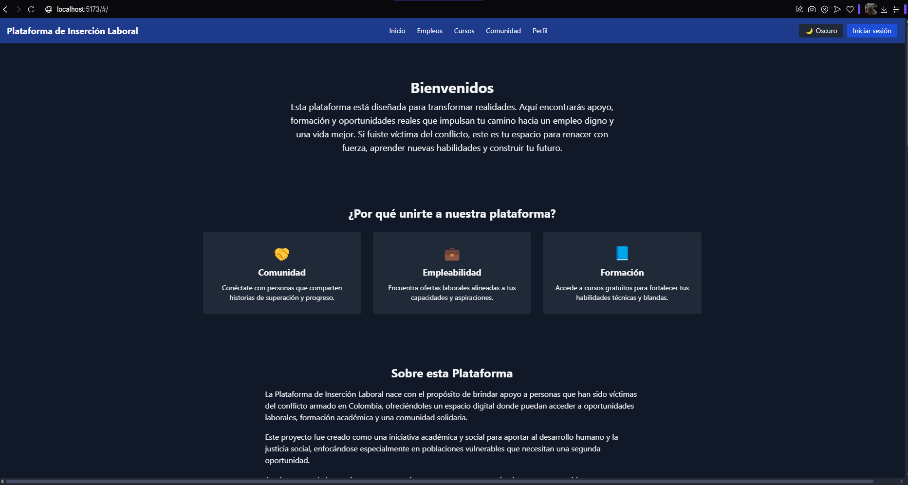
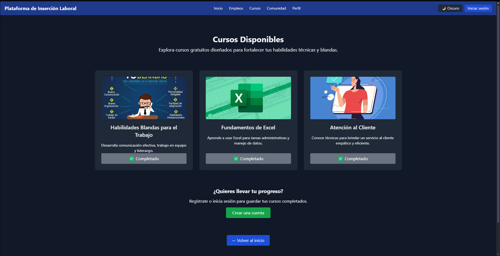
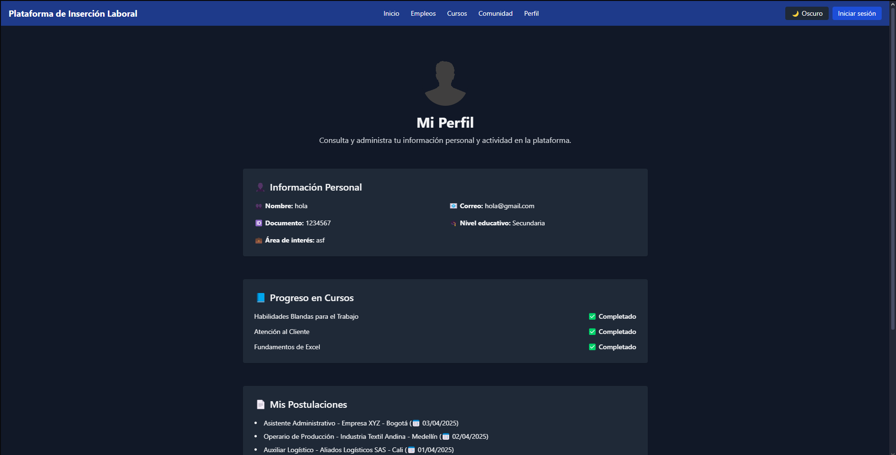

# insercionLaboral

Este proyecto web busca conectar a **víctimas del conflicto armado en Colombia** con oportunidades laborales, capacitación técnica y una comunidad solidaria. Fue desarrollado como una iniciativa académica y social para fomentar la **inclusión laboral** a través de la tecnología.

## 🚀 Tecnologías Utilizadas

- [Vite](https://vitejs.dev/) + [Vanilla JS](https://developer.mozilla.org/es/docs/Web/JavaScript)
- [Tailwind CSS](https://tailwindcss.com/) para estilos rápidos y responsivos
- [Swiper.js](https://swiperjs.com/) para carruseles interactivos
- `localStorage` para simular persistencia de datos (registro, cursos, postulaciones)
- Animaciones con [AOS (Animate on Scroll)](https://michalsnik.github.io/aos/)

## 📂 Estructura del Proyecto

```
plataforma-insercion-laboral/
│
├── index.html              # Entrada principal del sitio
├── src/                    # Lógica y vistas del proyecto
│   ├── components/         # Navbar, Footer, Toasts, etc.
│   ├── pages/              # Home, Cursos, Empleos, Comunidad, Perfil, Login, Register
│   ├── assets/             # Imágenes y logos del sitio
│   └── utils/              # Ruteador y controladores
├── tailwind.config.js      # Configuración de TailwindCSS
├── postcss.config.js       # Configuración para procesar CSS
├── vite.config.js          # Configuración del servidor local
├── package.json            # Dependencias y scripts del proyecto
└── README.md               # Este archivo
```

## 🧠 Funcionalidades Principales

- ✅ Registro e inicio de sesión (con simulación en `localStorage`)
- 📘 Inscripción y seguimiento de progreso en cursos
- 💼 Postulación a empleos disponibles
- 🧑‍🤝‍🧑 Espacio comunitario con historias inspiradoras
- 🌗 Modo claro / oscuro
- 📊 Sección de estadísticas actualizadas dinámicamente
- ✅ Animaciones en todas las páginas para mejorar la experiencia visual

## 📸 Vista previa

**Página de inicio:**


**Cursos y progreso:**


**Perfil y actividad del usuario:**


> Nota: Las imágenes anteriores pueden variar según la configuración local y datos del navegador.

## 🧪 ¿Cómo correr el proyecto?

1. Clona el repositorio:

```bash
git clone https://github.com/Aslannt/insercionLaboral.git
cd insercionLaboral
```

2. Instala las dependencias:

```bash
npm install
```

3. Inicia el servidor de desarrollo:

```bash
npm run dev
```

4. Abre [http://localhost:5173](http://localhost:5173) en tu navegador.

## 🧾 Nota importante

- No necesitas subir `node_modules` al repositorio. Asegúrate de tener un archivo `.gitignore` con:

```
node_modules
dist
.env
```

---

## 💡 Próximos pasos sugeridos

- Conectar con una base de datos real como Firebase o Supabase.
- Agregar autenticación real con tokens o proveedores OAuth.
- Mejorar accesibilidad (etiquetas `aria`, tabIndex, roles).
- Exportar estadísticas como PDF o Excel.
- Añadir buscador de empleos o cursos.

---

## 📜 Licencia

Este proyecto es de uso académico y educativo. Libre para compartir y adaptar con fines sociales.

---
